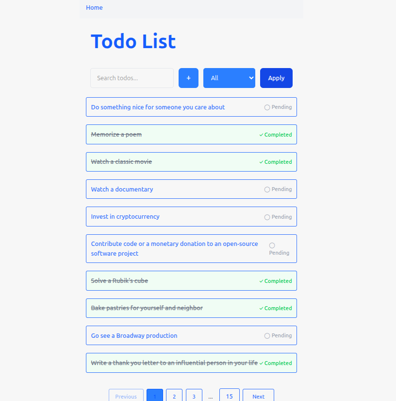
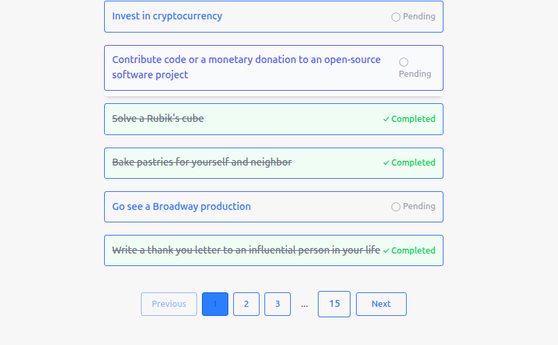
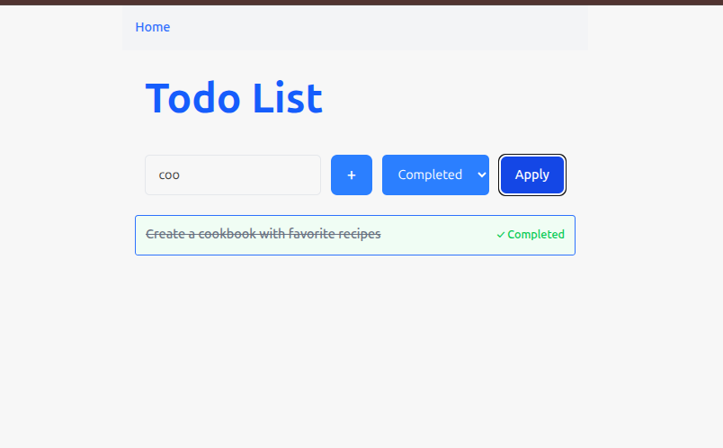
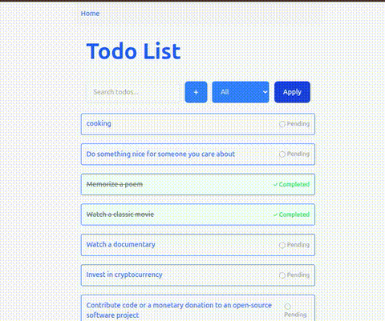
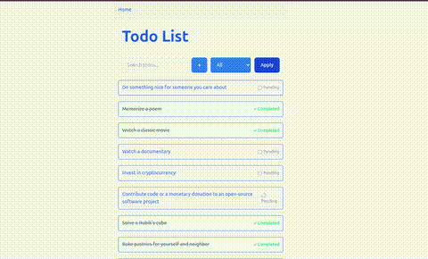

# Todo List Application

## 📌 Project Description
A feature-rich Todo List application built with React and TanStack Router that helps users organize their tasks efficiently. The app communicates with the DummyJSON API for todo operations.

 

## ✨ Key Features
- **Task Management**
  - Add new todos
  - View all todos with pagination
  - Mark todos as complete/incomplete
  - View todo details

- **Search & Filter**
  - Search todos by text content
  - Filter by status (All/Active/Completed)

- **Responsive Design**
  - Works on mobile, tablet, and desktop
  - Clean, intuitive interface

## 🛠️ Installation & Setup

### Prerequisites
- Node.js (v16+)
- pnpm (v10+) or npm

### Setup
```bash
# Clone the repository
git clone https://github.com/teesmile/todo-app.git
cd todo-app

# Install dependencies
pnpm install

# Start development server
pnpm run dev
```

## Available Scripts

```bash
# Start development server
pnpm run dev

# Create production build
pnpm run build

# Preview production build
pnpm run preview

# Run tests (if configured)
pnpm run test

# Run linter
pnpm run lint

```

## 🧩 Technology Stack

| Category        | Technologies                          |
|-----------------|---------------------------------------|
| Frontend        | React, TanStack Router                |
| Styling         | Tailwind CSS                          |
| Build Tool      | Vite                                  |
| Mock API        | [DummyJSON](https://dummyjson.com/docs/todos#todos-all) |

### Architecture Decisions
- Client-side filtering for better performance  
- Local state management for immediate UI updates  
- Responsive-first design approach  
- Optimized pagination implementation  

# **Note:** DummyJSON doesn't persist changes - added todos only exist in local state.

## 🖥️ Usage Guide

### 1. Browsing Todos
 
- Todos are paginated (10 per page by default)
- Use pagination controls at bottom to navigate

### 2. Searching & Filtering
 
- **Search:** Type in the search field to filter by text
- **Status Filter:**
  - `All`: Show all todos
  - `Active`: Only incomplete todos
  - `Completed`: Only finished todos

  ### 3. Adding a Todo
 

1. Click the "+" button
2. Enter your task in the modal
3. Click "Add Todo"

### 4. Viewing Todo Details
 

1. Click any todo item
2. View details on the dedicated page
3. Toggle completion status with checkbox
4. Click back button to return

## ⚠️ Known Limitations
- No persistent data storage (DummyJSON limitation)
- No user accounts or authentication
- No offline capability
- No Delete Action
- No Edit Action
- No Toggle completed/pending todo working (Just place holder for now)
- No drag-and-drop reordering

## 🚀 Future Updates

### High Priority
- [ ] **Data Persistence**
  - Implement localStorage for offline access
  - Add sync functionality when online
  - Backup/Restore functionality

- [ ] **Todo Management Features**
  - Delete button with confirmation dialog
  - Edit button with inline editing
  - Drag-and-drop reordering

### UI Improvements
- [ ] **Add New Todo Enhancement**
  - Priority levels (High/Medium/Low)
  - Due date picker
  - Tags/Categories system

- [ ] **Visual Upgrades**
  - Dark/light mode toggle
  - Animated transitions
  - Improved mobile experience

### Core Functionality
- [ ] **Bulk Operations**
  - Select multiple todos
  - Batch complete/delete
  - Move between categories

- [ ] **Advanced Features**
  - Keyboard shortcuts
  - Voice command support
  - Recurring tasks

  ## 🤝 Contributing
1. Fork the repository
2. Create your feature branch (`git checkout -b feature/AmazingFeature`)
3. Commit your changes (`git commit -m 'Add some AmazingFeature'`)
4. Push to the branch (`git push origin feature/AmazingFeature`)
5. Open a Pull Request

## 📜 License
Distributed under the MIT License. See `LICENSE` for more information.
